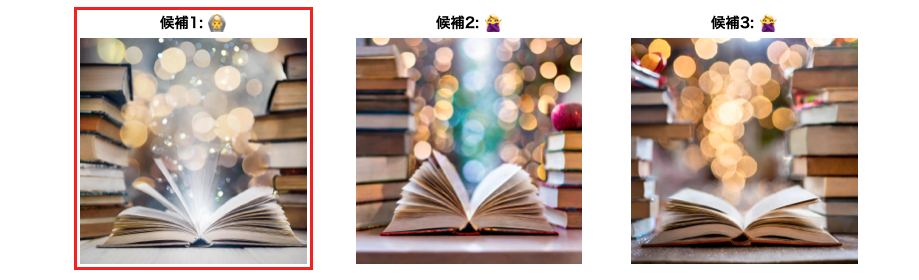

## 技術書同人誌博覧会の次回案内デザイン制作で画像生成AIを活用する

<strong>酒井文也 (Fumiya Sakai) Twitter &amp; github: @fumiyasac</strong>

## はじめに

現在私は「技術書同人誌博覧会（以下、技書博）」のコアスタッフとしてデザイン協力に携わっています。最近では、個人的な取り組みの中で、デザインワークが必要な場面が増えた事もあり、「画像生成AIを上手に活用する事でアイデアを効率的かつ素早く形にする事はできないか？」と思い立ちました。

その様な中、丁度良きタイミングで技書博11（2025年1月25日開催）の次回案内を制作をする運びになったので、以前から気になっていた画像生成AI「Adobe Firefly[^1]」をデザインの中で活用する事にしました。

本稿では、技書博11の次回案内デザインの過程において、どの様な形で画像生成AIを活用したかを簡単ではありますがご紹介できればと考えております。

[^1]: https://www.adobe.com/jp/products/firefly.html

## 完成イメージと素材選定

デザインに関する打ち合わせの中で「横浜のみなとみらいの夜景と開いた書籍の中からジャンルを表すもの、または関連キーワードが溢れ出しているイメージのものにしたい！」というアイデアが出ました。背景デザインを考える際に「1.夜景」と「2.開いた書籍」という2つの全く異なる属性のものを上手く組み合わせた形にする必要があったため、前段となる素材選択が重要になると考えました。

私がいつも利用している写真素材サービス等はありますが、お目当てのものが見つからなかった事や、思い切って表現の幅を広げてみたい意図もあったため、背景デザインの元となる画像素材についてはAdobe Fireflyで生成したものを利用しました。場合によっては、生成した画像素材を更にデザインツールを等を利用して適宜加工等を必要はありますが、発表当初よりも精度やクオリティは格段に上がっているので有効活用可能な余地は十分にあると感じています。

## Adobe Fireflyを活用してお目当ての画像素材を得る

Adobe Fireflyの使い方そのものは結構シンプルで、設定パネルで詳細情報を設定して、プロンプトにキーワードを入力して実行すると、最大4枚の画像が生成されます。

これを何度か繰り返しながら、今回のコンセプトに合いそうな画像素材を探すことになります。

画像生成時の詳細情報については、

- 利用する生成モデル・縦横比・アートか写真かの設定
- 構成やスタイルをユーザーがアップロードした画像を参考にする
- 画像生成時に効果を付与して加工した状態にする
- カラーとトーン・ライト・カメラアングルを指定する

事が可能ですので、用途やイメージに合わせて柔軟に条件を設定できると思います。また、実行プロンプトと出力された画像素材のイメージを確認しやすいインターフェイスである点も、個人的にお気に入りポイントだと感じています。

※ Betaラベルのない機能の場合は、生成された出力を商用プロジェクトで使用可能です。

※ 料金やクレジットに関する詳細は、生成AIを含むプランを比較[^2]のWebページに詳細が掲載されています（ちなみに、私は「Adobe Creative Cloud」の年間サブスクリプションを契約して利用しています）。

[^2]: https://www.adobe.com/jp/products/firefly/plans.html

今回のデザインで利用した素材候補と実行したプロンプトはこちらになります。

__(1) 書籍が開いた状態を表現した画像素材__

書籍が開いた状態を表現して、なおかつ書籍から様々な光が溢れ出る素材を選択しました。

- 実行プロンプト: `書籍に囲まれている` / 生成実行回数: `5〜6回程度`

__(2) 横浜の夜景を表現した画像素材__

当初は「横浜の夜景」で生成していましたが、ぱっと見で横浜が少しイメージしづらかったため「豪華客船」というキーワードを追加する事で、より連想できると思ったので、海上の豪華客船と夜景がを組み合わせた素材を選択しました。

- 実行プロンプト: `横浜の豪華客船と夜景`/ 生成実行回数: `3〜4回程度`

今回はAIで生成した画像素材ではありますが、なるべくリアルの写真に近くなる様な設定を生成時にしています。実際は画像素材をそのまま利用するのではなく、デザインツール等を利用して加工する想定でしたが、この時点で実際の写真にかなり近いものを生成できた点は驚きました。

例えば、予め自分が想像している写真で「こんな感じのイメージが合いそうと感じたものを準備しておく」様にすると、画像生成用のプロンプトを考える際や、生成した画像素材を選定する際には役に立つと思います。（過去の制作物についても、#9一般参加案内＆技書博mini案内の背景ではAI生成画像を活用しています！）

## 実際にデザインを作成するプロセスに関する解説

ここからはデザインを組み立てていくプロセスを簡単に解説していこうと思います。背景素材はAdobe Photoshopを利用して加工し、フライヤー制作はAdobe Illustratorを利用しています。

__(1) フライヤー背景素材でPhotoshopで作成する過程__

こちらは、前述したAdobe Fireflyで生成した2つの画像を重ねて合成する事で実現しています。今回は幸運にも、拡大縮小・レベル補正やトーンカーブによる色味・アルファ値の調整などの基本的な調整のみで済ませる事ができました（素材制作の工数は選択した素材やデザインによって変化しますが、今回は想像以上にこの工程がすんなり進みました）。

__(2) 書籍が開いた状態を表現した画像素材__

次に、制作した背景素材を利用してA4サイズを想定したフライヤーに落とし込んでいきます。前述した背景素材をそのまま利用すると全体的にくすんでしまった感じになったため、紫色と青色の中間くらいの色を重ねる事によって告知情報が目立ちやすくなる様にしました。また、技術系同人誌即売会であることを想定し、関連するキーワードが開いた書籍から湧き上がって来る様なデザインに仕上げました。

※ 関連するキーワードの表現については、文字に対して枠線を作り、その枠線に対してぼかしを加える事で表現しています（制作当初はネオン光彩の様なデザインを考えていましたが、大きな明朝体でないと映えない事や加工手順が少し面倒に感じたので、今回は利用しませんでした。※参考:光る文字を作る[^3]）。

[^3]: https://www.mdn.co.jp/reference/Illustrator/170

## まとめ

今回は、想像以上に画像生成AIの力を借りる事ができた実感を持っています。デザイン進行管理をしていた方も「いい表現が思いつかない」と悩んでいたので、背景イメージに合う表現を素早く見出す事ができた点が解決に繋がったのではないかと思います。

Adobe Fireflyを利用したAI生成画像の完成度も高く、プロンプト操作や各種設定をする操作体験も良かったので、今後も積極的に活用ができればと考えています。

画像生成AIを上手くデザイン関連作業に活用する事で、これまで大変であった手順を簡略化・省力化する工夫に繋がり、それが更に速さを出す事にも繋がるのではないかと感じた次第です。