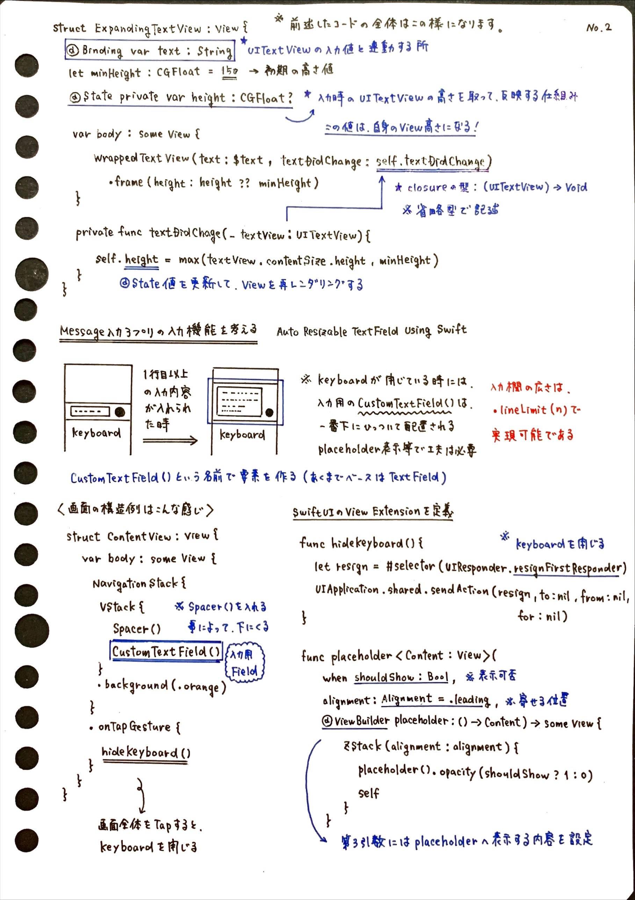
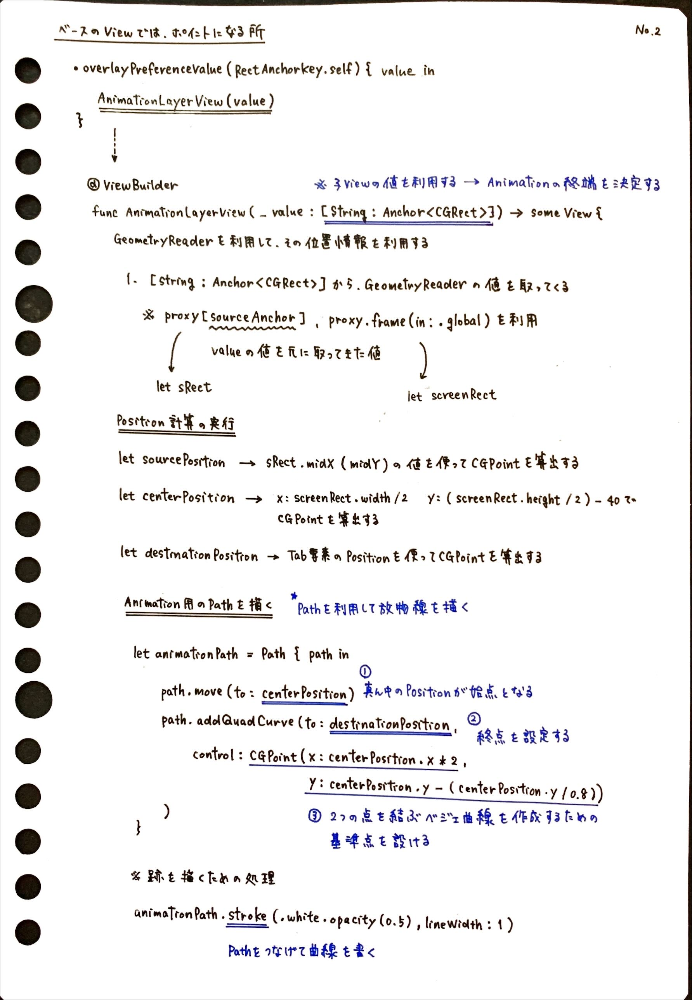

## 良いアウトプットのためのインプットとノート整理

<strong>酒井文也 (Fumiya Sakai) Twitter &amp; github: @fumiyasac</strong>

## はじめに

技術的な知識を効果的に学ぶためには、単に情報を受け取るだけでは十分ではありません。真の理解は、得た情報を自分なりに噛み砕き、視覚的に整理することから生まれます。私のエンジニアリング学習において最も大切にしているのは、調査した技術トピックを手書きでノートにまとめるというアプローチです。

このノート作成は、ただの書き写しではありません。サンプルコードの実装における重要なポイントを、自分の視点で抽出し、言葉にすることで、技術的概念の本質的な理解に近づきます。手で書くという行為は、デジタル的な記録とは異なる、より深い思考のプロセスを引き出してくれます。指先で情報を紡ぐことで、抽象的な概念を具体的な知識に変換できるのです。

例えば、

- コードの背後にある設計思想
- アルゴリズムの論理的な構造
- 実装上で工夫しているポイント 

等、書籍やサンプル実装コード、動画教材等から得られた情報を自分なりの言葉や図解でノートに記録することで、技術の表面的な理解から、より深い洞察へと成長できると思います。

情報を受け取るだけでなく、自分なりの学びの地図を描くこと。それが、私の技術学習における最も大切な方法だと考えています。

## 進める際の個人的ポイント

エンジニアとして、技術的な知識を学ぶ際に大切にしているのは、ただ情報を集めるだけではなく、その本質を理解し、将来活用できる形で整理することです。

私の学習スタイルは、様々なリソースから得られる情報の断片を、パズルのピースのようにつなぎ合わせていくアプローチです。書籍、サンプルコード、オンライン講座、動画教材など、多様な情報源から学びを得ながら、それぞれの知識がどのようにつながっているのかを、できる限り丁寧に紐解いていきます。

新しい専門用語や技術的概念に出会うたびに、徹底的に調べて理解を深めます。関連する事例や周辺知識も積極的に探求し、自分の技術的な知識の幅を広げていきます。複雑な概念は、できるだけ簡潔な図解や視覚的な表現に置き換えることで、より直感的に理解しやすくします。

手書きのノートは、私にとってはこの学習プロセスの中心的なツールです。単なるメモ帳ではなく、後で見返したときに、すぐに記憶が呼び起こせるような、自分だけの知識マップを作り上げる様なイメージでしょうか。ここで大切なのは、このノートを通じて得た知識が、将来の技術的な課題や問題解決に、柔軟かつ実践的に活用できる形で整理されていることです。

情報を取り入れ、整理し、そして最終的に自分のものとして活用できるようにする。
このサイクルが、私にとって技術者としての成長を支える原動力となります。

私にとってノート作成は、技術的な知識を生きた知恵へと変換するための方法かもしれません。

## 実践したメリット

技術を学ぶ上で大切なのは、ただ情報を集めるだけではなく、その本質を理解することです。私は、手書きのノートを通じて、技術的な知識を深く、そして自分なりに理解する方法を見つけてきました。

サンプルコードや技術資料から重要なポイントを丁寧に抽出し、整理していくこのアプローチは、表面的な学習を超えて、技術の本質に迫ろうとするものです。理論的な理解と、実際の実装イメージを同時に育むことで、単なる暗記とは異なる、深い学びを実現しています。

一見すると時間のかかる学習方法に思えるかもしれません。しかし、じっくりと知識を自分のものにしていくこのプロセスには、大きな利点があります。技術的な概念を自分なりに咀嚼し、視覚化することで、似たような課題に直面したときにも、落ち着いて対応できるようになります。

手書きでノートをまとめる行為は、ただの記録以上の意味を持つと考えています。得られた知識は、仕事や個人的な開発において、柔軟に活用できる「引き出し」となります。特に、実装イメージが似ている技術的な課題に取り組む際には、以前の学習が大きな助けとなり、問題解決のスピードを上げることができます。

デジタル技術が急速に進化する現代において、情報の洪水の中で本当の理解を得ることは簡単ではありません。このような学習方法は、ただ知識を詰め込むのではなく、技術の本質を理解し、実践的な応用力を育む、とても効果的なアプローチだと考えています。

エンジニアとして成長し続けるためには、自分に合った学習方法を常に模索し、改善していくことが大切です。手書きのノートを通じた学習は、そんな個人的な学びの探求の一つの形と言えるでしょう。

## まとめ

技術の世界は日々変化し続けています。その中で、真の学びとは単に情報を集めることではなく、得た知識を自分のものとし、実践に活かせる知恵に変えていくプロセスそのものです。私が大切にしている手書きノートによる学習は、まさにこの技術者としての成長の本質を体現しているのかもしれません。

デジタル時代には、膨大な情報があふれていますが、本当の理解は情報の量ではなく、その質によって決まります。サンプルコード、技術書、オンライン教材から得られる断片的な知識を、自分の手と頭で丁寧につなぎ合わせていくこと。それが、表面的な知識のCollectionから、技術の本質的な理解への道だと考えています。

手書きのノートは、単なるメモ帳ではありません。それは思考を可視化するキャンバスであり、抽象的な概念を具体的なイメージに変換する、最も個人的で創造的な学びの方法です。理論と実践をつなぐ、私だけの知識の地図とも言えるでしょう。

このアプローチの真の価値は、知識を暗記することではなく、学んだことを実際に活かせるようになることにあります。似たような技術的な課題に直面したとき、過去の学びがすぐに思い出せ、落ち着いて対応できる柔軟性が身につきます。蓄積された知識は、問題解決の力を大きく後押しする、目に見えない財産となります。

エンジニアとして成長するということは、常に自分に合った学び方を探し、改善し続けることです。手書きのノートによる学習は、単なる技術の記録方法ではなく、自分の知的好奇心を大切にする姿勢そのものなのかもしれません。

最終的に、私たちエンジニアに求められるのは、技術の表面をなぞるのではなく、その本質を理解し、創造的に活用する力です。情報を受け取り、自分なりに咀嚼し、血肉化する。このサイクルが、技術者としての成長を支える原動力となるのです。
